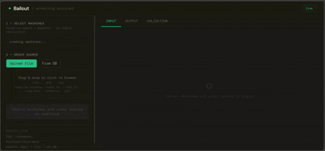
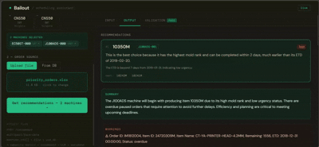

# 🚀 Bailout – Production Scheduling Assistant

**Tagline:**
*Turn historical production data into real-time decisions*

---

## 🧩 Problem statement

Small-scale manufacturing companies often rely heavily on a single key coordinator — the person who holds the entire machine scheduling logic in their head. When that person is absent, the whole production line gets disrupted because no one knows which job should run next after a machine finishes.

The real problem is not a lack of people — it’s that experience is trapped in one individual’s mind instead of being encoded into reusable data. Historical production data already contains enough patterns to support — and in many cases outperform — human judgment, but it has not yet been properly leveraged.

---

## 💡 Core Insight

> **Experience is not magic — it is pattern recognition built from historical data.**

What expert planners do intuitively:

* Recognize patterns in job transitions
* Reuse successful decisions from similar past situations
* Balance trade-offs based on context

👉 These patterns already exist in historical production data — they are just not being systematically extracted or reused.

---

## 🛠️ Solution

**Bailout** is a lightweight **Production Scheduling Assistant** that:

* Takes minimal input:

  * Number of machines about to become idle
  * List of pending jobs
* Reconstructs decision patterns from historical production data
* Suggests the **next best job** for each machine
* Provides **clear, data-driven explanations** for every recommendation

---

## ⚙️ How It Works

### Layer A – Recommendation Engine (Business Logic)

Reconstructs machine-mold-job decision patterns from historical production data. 

It builds a **weighted capacity matrix** per (machine, mold) pair — blending spec-based defaults with actual run history, where older records contribute less.

From this, it derives a **priority ranking** of machines per mold, then matches pending orders to the best-fit machine based on mold compatibility, delivery deadline, throughput, and backlog size.

👉 More details in [recommendation_engine](docs/recommendation_engine.md)

---

### Layer B – Orchestrator & LLM Client

Coordinates the full request cycle — from user input to human-readable output.

It resolves the order source (uploaded file or database), runs the recommendation engine, and applies an **automatic fallback**: if no matching orders are found in the uploaded file, it silently switches to database orders and notifies the user.

The LLM's role is strictly to **explain, not decide** — all ranking and machine assignment logic lives in Layer A. The LLM receives a fully computed result and translates it into plain language, with every output validated against the system's ground truth before reaching the user.

👉 More details in [orchestrator & llm_client](docs/orchestrator_llm_client.md)

---

## 🧠 Demo

**Upload file** — select machines, attach a priority order list, get recommendations



---

**From DB** — select machines, pull pending orders directly from production database



---

## Quickstart

### Option A — Run via Google Colab (Recommended)

No local setup needed. Open the notebook and follow the steps:

👉 [Open in Google Colab](https://colab.research.google.com/github/ThuyHaLE/Bailout/blob/main/bailout_demo.ipynb)

**Prerequisites:**
- A Google account
- A free ngrok account → get your authtoken at [dashboard.ngrok.com](https://dashboard.ngrok.com/get-started/your-authtoken)
- An OpenAI API key → [platform.openai.com/api-keys](https://platform.openai.com/api-keys)

The notebook will clone the repo, install dependencies, build the UI, and give you a shareable URL.

---

### Option B — Run locally

**Prerequisites:** Python 3.10+, Node.js 18+
```bash
git clone https://github.com/ThuyHaLE/Bailout.git
cd Bailout 

pip install -r requirements.txt

# Build the control panel
cd control_panel
npm install
npm run build
cd ..

# Add your OpenAI API key
cp .env.example .env            # then edit .env

# Start the server
python main.py
```

Open [http://localhost:8000](http://localhost:8000) in your browser.

---

## ✨ Key Features

- **Weighted capacity with time decay** — bridges the gap between spec-based   defaults and actual run history. Production records are bucketed by recency (0–30d, 31–60d, ... >180d) with decaying weights, so the system naturally trusts recent data more and reduces dependence on stale records as production conditions shift over time.

- **Flexible order input** — planners can upload a custom PO list (urgent orders, priority items, customer-specific batches) instead of relying solely on the database. The system matches uploaded orders first, making it practical for real scheduling decisions rather than just historical replay.

- **Automatic fallback: file → DB → warning** — if no compatible orders are found in the uploaded file for a machine, Bailout silently falls back to database orders and notifies the user. This minimizes idle machine time without requiring manual intervention.

- **Active mold exclusion + cross-machine deduplication** — molds currently running in the latest shift are automatically removed from the candidate pool, preventing double-assignment. Across machines, once an order is assigned to the best-fit machine, it is excluded from all others — no two machines are recommended the same job.

- **LLM as a translator, not a decision-maker** — all ranking and assignment logic is deterministic and runs entirely in the recommendation engine. The LLM only explains the output in plain language, making it accessible to non-technical staff without introducing uncertainty into the scheduling logic. A built-in validation layer checks every LLM response against the system's ground truth before it reaches the user — catching hallucinations before they cause confusion.

---

## 🎯 Why It Matters

Most small-scale factories carry a hidden single point of failure: the one person who holds the entire scheduling logic in their head. When that person is absent, production slows or stops — not because the information doesn't exist, but because it was never captured in a reusable form.

Bailout treats that institutional knowledge as a data problem. Historical production records already contain enough signal to reconstruct most of what experienced planners do intuitively — which machine runs which mold best, which orders are at risk, how to sequence jobs to minimize idle time. Bailout makes that signal explicit and actionable.

It's not designed to replace the planner. It's designed to make sure production doesn't stop when they're not around.

---

## 🏗️ Tech Stack
```
React + Vite  →  FastAPI  →  Orchestrator
                                  ├── Recommendation Engine  (pandas)
                                  └── LLM Client  (OpenAI / ... API)
```

| Layer | Technology |
|---|---|
| Frontend | React 18, Vite, DM Mono / DM Sans |
| Backend | Python, FastAPI, uvicorn |
| Data processing | pandas, openpyxl |
| LLM | OpenAI GPT-4o / Anthropic Claude (swappable) |
| Tunneling (demo) | ngrok |

---

## 🚧 Future Improvements

- **Real-time data feed** — replace Excel uploads with a live connection to MES or ERP systems so production records are always current
- **Multi-shift planning** — extend recommendations beyond the next idle machine to a full shift schedule across all machines
- **Feedback loop** — allow planners to accept or reject recommendations, feeding that signal back to improve future capacity weights
- **Domain fine-tuning** — adapt LLM explanations to factory-specific vocabulary and product naming conventions
- **Multi-tenant support** — extend to multiple production lines or factories with separate data and configuration per site

---

## 🏁 Conclusion

Bailout is a proof of concept that complex scheduling logic doesn't require complex AI. A well-structured data pipeline — weighted by recency, validated at every step, and explained in plain language — can surface most of what an experienced planner already knows intuitively.

The LLM is a deliberate last step, not the core. Its job is to make dry production data readable to anyone on the floor, not to make decisions. That boundary is what makes the system trustworthy enough to actually use.


